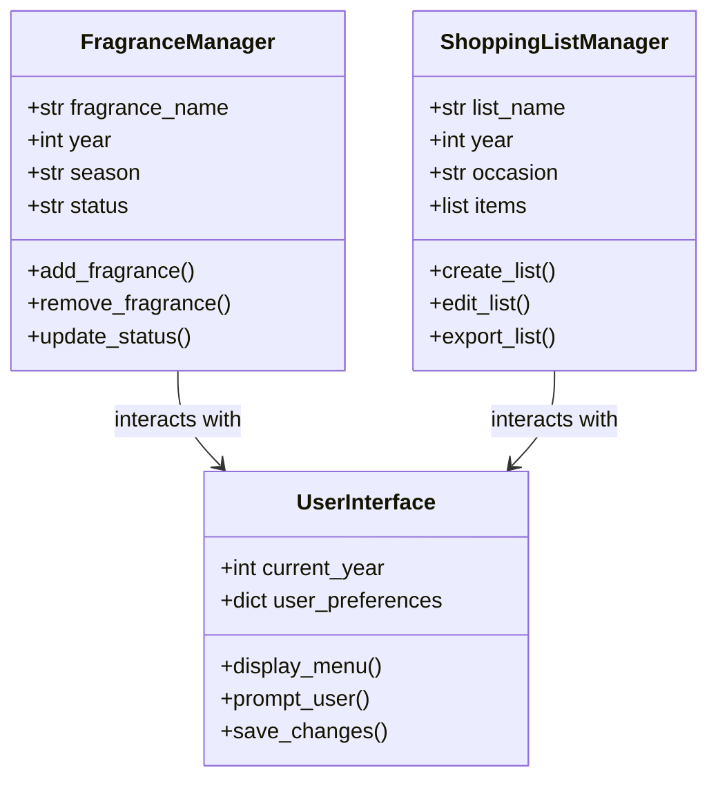

# Python Application for: Bath & Body Works
[Link to Github Repository](https://github.com/kschenk10-ivy-tech/SDEV-220_Final-Project)

**Overview:**
This Python application is designed for Bath & Body Works customers to log and track their favorite fragrances by year and season. 
Users can create shopping lists linked to birthdays, holidays, and special occasions, organizing purchases by week, day, and year.

**Purpose:**
The purpose of this system is to provide a user-friendly interface for customers to manage their fragrance collections, 
organize shopping lists by season and occasion, and track their preferences over time. The system will also allow users to 
set reminders, export lists, and calculate ages for birthday-related events.

**Scope:**
The system will include the following features:
- Fragrance Collection Management: Add, update, and categorize fragrances.
- Seasonal Organization: Organize fragrances by year and season.
- Shopping List Integration: Create and manage shopping lists for birthdays, holidays, and special events.
- Status Labels: Assign statuses to fragrances (e.g., "SHOPPING LIST", "I Have Not Smelled", "I Like This One").
- Data Storage & Retrieval: Save and access data using JSON files.
- Birthday Computation: Calculate ages and days until next birthday.
- User Prompts & Actions: Create, edit, export, and share lists with notifications.

**General Design:**
The system will be designed with a graphical user interface (GUI) using a library such as Tkinter or PyQt. 
It will interact with three main classes: Fragrance, ShoppingList, and User. The system will utilize collections 
such as lists, dictionaries, and tuples to store and manage data. Data will be persisted using JSON files.

**Classes:**
1. `Fragrance`: Represents a fragrance with attributes like name, season, year, and status.
2. `ShoppingList`: Manages shopping lists with attributes like list name, year, season, and associated fragrances.
3. `User`: Represents the user with attributes like name, email, and notification preferences.

## Class Diagram

---

