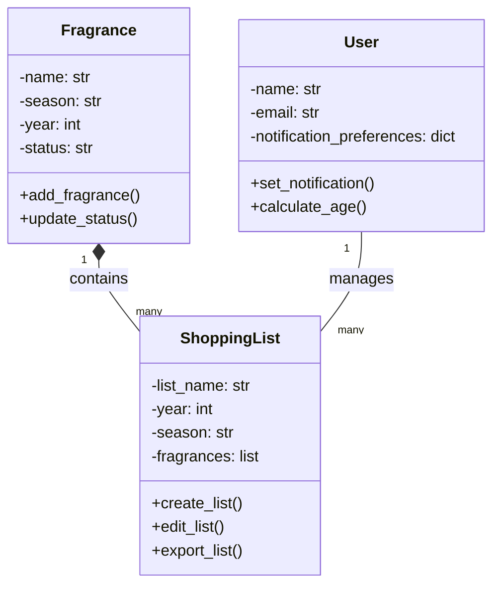
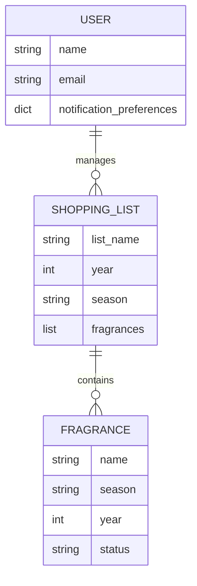

**Application Overview**

This Python program is designed to manage fragrance collections and shopping lists, utilizing the Tkinter library for the graphical user interface (GUI) and JSON for data storage.

**Overview of the application’s structure:**

**Main Components:**The application consists of two primary functions:

1. **Fragrance Management:** This feature allows users to add, edit, and remove fragrances. Users can categorize fragrances by season and assign statuses for event planning.
2. **Shopping List Management:** This function enables users to manage shopping lists with similar capabilities to those of the fragrance management, including adding, editing, and removing items.

**Key Features**

1. **Data Model:**

   - **Fragrance:** An object representing a fragrance entry, with attributes such as name, brand, season, and status.
   - **ShoppingList:** An object representing a shopping list item, with attributes like item name, category, and quantity.
     Manager classes will handle collections of these objects and will be responsible for loading and saving data in JSON format for persistence.
2. **GUI with Tkinter:**

   - **Tabs for Navigation:** The application will feature a tabbed interface, with one tab dedicated to managing fragrances and the other for shopping lists.
   - **Forms for Data Entry:** Users will fill out forms to enter information about fragrances or shopping list items, which will include fields for all relevant attributes.
   - **Update/Delete Options:** Users will have the ability to update or delete existing entries.
3. **Event Handling and Computation:**

   - **Age Calculation/Days Until:** The program will leverage Python’s datetime module to calculate the age of a fragrance or count down the days to an event or reminder date.
4. **Data Persistence with JSON:**

   - **Load/Save Functionality:** All data will be stored in JSON format for easy retrieval and storage. Each manager class will handle reading from and writing to JSON files to maintain data between user sessions.

---

```python
"""
Python Application for: Bath & Body Works
Github Repository: [Insert Link Here]

Overview:
This Python application is designed for Bath & Body Works customers to log and track their favorite fragrances by year and season. 
Users can create shopping lists linked to birthdays, holidays, and special occasions, organizing purchases by week, day, and year.

Purpose:
The purpose of this system is to provide a user-friendly interface for customers to manage their fragrance collections, 
organize shopping lists by season and occasion, and track their preferences over time. The system will also allow users to 
set reminders, export lists, and calculate ages for birthday-related events.

Scope:
The system will include the following features:
- Fragrance Collection Management: Add, update, and categorize fragrances.
- Seasonal Organization: Organize fragrances by year and season.
- Shopping List Integration: Create and manage shopping lists for birthdays, holidays, and special events.
- Status Labels: Assign statuses to fragrances (e.g., "SHOPPING LIST", "I Have Not Smelled", "I Like This One").
- Data Storage & Retrieval: Save and access data using JSON files.
- Birthday Computation: Calculate ages and days until next birthday.
- User Prompts & Actions: Create, edit, export, and share lists with notifications.

General Design:
The system will be designed with a graphical user interface (GUI) using a library such as Tkinter or PyQt. 
It will interact with three main classes: Fragrance, ShoppingList, and User. The system will utilize collections 
such as lists, dictionaries, and tuples to store and manage data. Data will be persisted using JSON files.

Classes:
1. Fragrance: Represents a fragrance with attributes like name, season, year, and status.
2. ShoppingList: Manages shopping lists with attributes like list name, year, season, and associated fragrances.
3. User: Represents the user with attributes like name, email, and notification preferences.

UML Class Diagram:



Entity Relationship Diagram (ERD):



Explanation of the ERD:

- USER: Represents the customer using the application. A user can manage multiple shopping lists.
- SHOPPING_LIST: Represents a list of fragrances organized by year and season. Each shopping list contains multiple fragrances.
- FRAGRANCE: Represents an individual fragrance with attributes like name, season, year, and status. Each fragrance belongs to a shopping list.

Project Management:
The project will be managed using a Kanban board to track tasks, progress, and deadlines. Tasks will be divided into modules,
including GUI development, class implementation, data storage, and testing.

Module 3: Final Project Launch

- Implement the GUI using Tkinter or PyQt.
- Develop the Fragrance, ShoppingList, and User classes.
- Integrate JSON file handling for data persistence.
- Implement birthday computation and notification features.
- Test the system for syntax and runtime errors.
- Document the project with a proposal, class diagram, and report of results with sample output.

To-Do:

- Implement an Excel file for birthday tracking using the provided formulas.
- Ensure the system meets all minimum requirements, including the use of collections and error-free execution.
  """

```

---

This header provides a comprehensive overview of the project, including its purpose, scope, design, and key components. The UML Class Diagram and ERD are included using Mermaid syntax for visualization. The project management section outlines the use of a Kanban board for task tracking.
```
