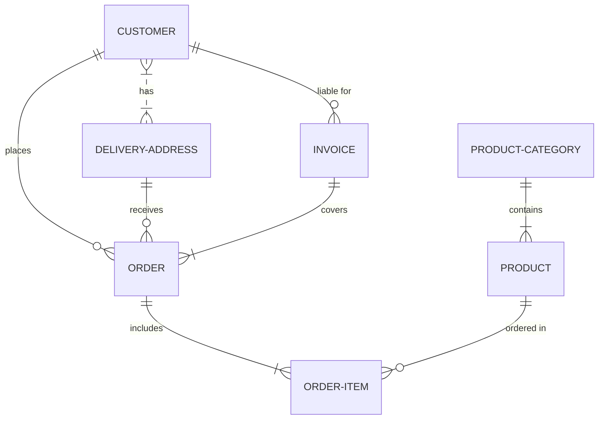


## Classes

1.  **FragranceManager**
    
    -   Attributes:  `fragrance_name`,  `year`,  `season`,  `status`
        
    -   Methods:  `add_fragrance()`,  `remove_fragrance()`,  `update_status()`
        
2.  **ShoppingListManager**
    
    -   Attributes:  `list_name`,  `year`,  `occasion`,  `items`
        
    -   Methods:  `create_list()`,  `edit_list()`,  `export_list()`
        
3.  **UserInterface**
    
    -   Attributes:  `current_year`,  `user_preferences`
        
    -   Methods:  `display_menu()`,  `prompt_user()`,  `save_changes()`

---
ER Diagram
User Journey Diagram
Architecture Diagram
Sequence Diagram
Git Graph Diagram
System Context diagram

